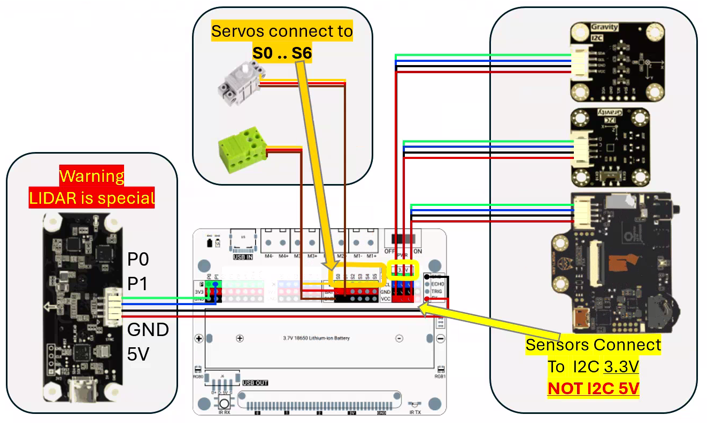

# READ THIS FIRST!
We strongly recommend to read this document before jumping in contest :)

#  Introduction

This document is your practical guide for the aMaker contest.
It covers the essential steps to build a functional bot using the elements and win the contest.

# Contest 
Build the best remote controlled bot, a champion that will keep its balloon longer than others. 
There will be several rounds where your bots will evolved in an arena, agains one or multiple other bots. To add a bit of spice and challenge : 
1. your bot ballon will be ** inflated and attached by an oppenent **
2. each round will start with 1 minute in autonomous mode, followed by 3 minutes with remote control allowed.

# Bill of material
You should have received: 
* 1 microcontroller board (with screen and camera)
* 1 LiDAR sensor
* 1 Accelerator sensor
* 1 Geomagnetic sensor
* 1 extension board, with a battery holder, lots of pins, **power switch** and **USB connector** for battery charging.
* 1 battery 18650 (loaded). **Be extremely carefull with polarity when plugin the battery**
* 1 set of lego bricks with plates, wheels, axles, tracks, gears.  ~[book_chapters.png](book_chapters.png)
* 2 servo motors : green ones 

* 2 angular servos : grey  ones 
* toothpicks and balloons

# Participant guide
You'll have to design and assemble your own bot **only with the provided pieces**.

Electronics is very easy ! You just have to 
- plug the microcontroller board in the extension board
- plug the servos you want to use to extension board pins S0 to S5 at your convenience.
- plug the i2c sensors and huskylens to **I2C 3.3V** 
- connect the LIDAR wires : green->p0 and blue->p1 (left side), red->5V black->GND (right side)

SAFETY FIRST L when powered **NEVER EVER LOOK AT LIDAR IN FRONT OF CAMERA** : it emits **invisible 905nm laser beams** and has no class 1 certification. The LIDAR must always directed to the "bottom"

Controlling your bot will be done via your computer using autonomous code,  keyboard, mouse,  joystick... 

## Building your bot

### Contraints
1. The electronics parts have to be protected from toothpicks (using transparent sheet or lego pieces)
1. The camera field of view must be free of obstacle (~90 degrees)
1. The LIDAR field of view must be free of obstacle (~120 degrees horizontally) and directed to bottom for safety,
1. The **balloon will be inflated and mounted by your oppenent** ;)

### Bot movement 

#### Tank mode
One motor on left track, one right track. 
Motors running in same direction => going forward / backward.
Motors running in opposite direction => turning on itself.

#### Car mode
One motor on the differential in and two wheels on the differential out, angular servo controls two direction wheels. Like a car. 

#### Tips
* There are plenty of other ways to nove your bot: be creative.
* The green servos are not very fast. Use gears to fasten.

### Motor servos

Motor speed can be set from -100 to +100. 
You may find some benefits using the gears to multiply rotation speed.

Mounting Motors may be tricky as holes are not symetrical on the box : some holes are 1/2 depth.

### Angular servos 

* Angular servo be set from 0 to 270 degree.
* It tries to hold its position and has no protection: under **too high effort it will burn**
 

### Mounting the toothpick
There are lots of ways to mount your tooth picks:
- static at end of a pole
- attached at end of and articulated arm
- ...

### Mounting the balloons
"You" will inflate and attach your balloon on your opponent bot, and  
your opponents will **inflat and mount their balloon on your bot**.
Don't think about cheating here :)

### Tips an tricks
- triple check the battery polarity before inserting and powering. 
- double check the servo connection direction
- Let the USB-c connector accessible
- Use the USB-c connector to charge the battery
- Let the power switch accessible
- Be iterative
- If you lack ideas, have a look at the book [The LEGO power functions idea book., Isogawa, Yoshihito](https://archive.org/details/legopowerfunctio0000isog_f2e0/page/4/mode/2up) : there are lots of ideas .

## Coding part

### Contest firmware.
The microcontroller is provided with a custom firmware for the contest.

#### Setup WiFi (optional)
On first boot, if no known WiFi is accessible, board will open its own access point `amaker-XXXXX` and show its name on screen. Connect to it using password `amaker-club`.
Once connected, read the board IP address and 5-character master token from the screen. Your controller will use both values to register over UDP.

#### UDP (port 24642)
The microcontroller exposes all contest control services on UDP port 24642. All commands use the binary protocol described in [binary-protocol](binary-protocol.html).

### Coding your controller

#### Code your own client
You will code your own controller that interacts with the bot firmware via UDP. Register with the token shown on screen, keep the heartbeat active, then send motor, servo, LED, or sensor commands.

Start from [quickstart](quickstart.html), then use [communication](communication.html) and [binary-protocol](binary-protocol.html) for the full protocol details.

#### tips
A python client is present in repo :)